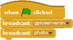

# BGC Bay Area Summer Camp 2018
# Building a Camera using Raspberry Pi

## Camera on Scratch

## Adding a button that takes a picture when pressed

## Adding a light when the picture is being taken

