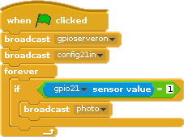
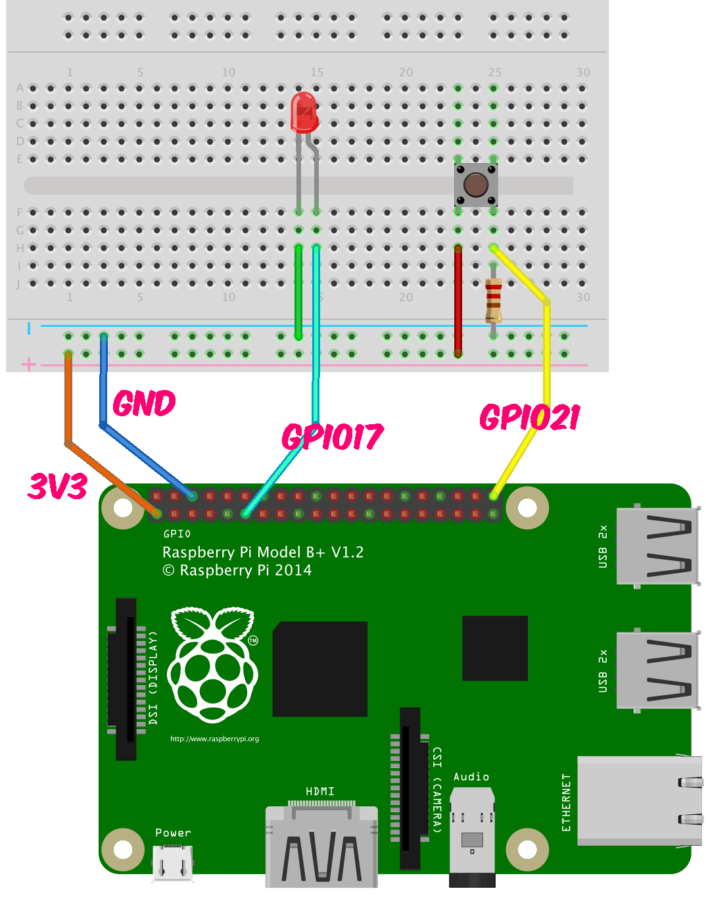

# BGC Bay Area Summer Camp 2018
# Building a Camera using Raspberry Pi

## 1. Camera on Scratch

## IMPORTANT. SAVE YOUR PROGRAM AND TURN OFF THE RASPBERRY PI BEFORE PLUGGING IN ANYTHING NEW

* * *

## 2. Adding a button that takes a picture when pressed

## IMPORTANT. SAVE YOUR PROGRAM AND TURN OFF THE RASPBERRY PI BEFORE PLUGGING IN ANYTHING NEW

* * *

## 3. Adding a light when the picture is being taken

## IMPORTANT. SAVE YOUR PROGRAM AND TURN OFF THE RASPBERRY PI BEFORE PLUGGING IN ANYTHING NEW

